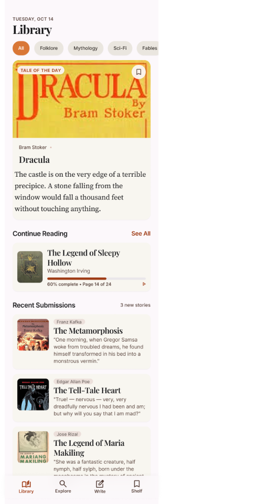
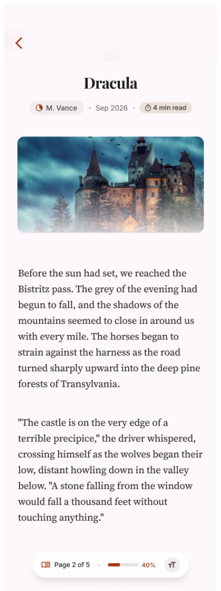
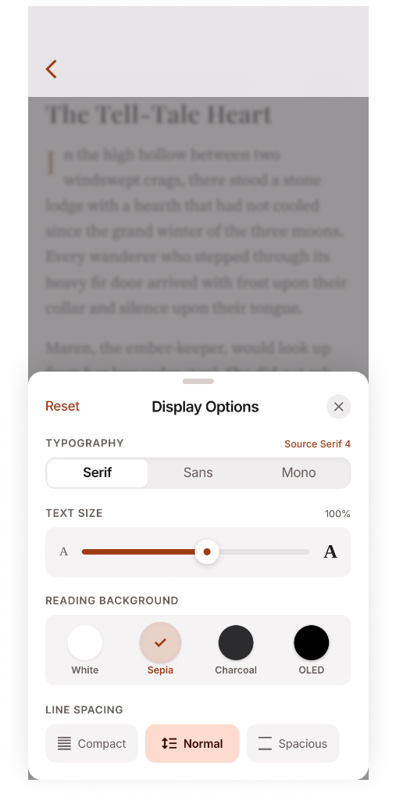
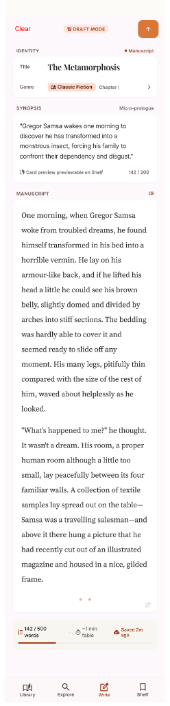
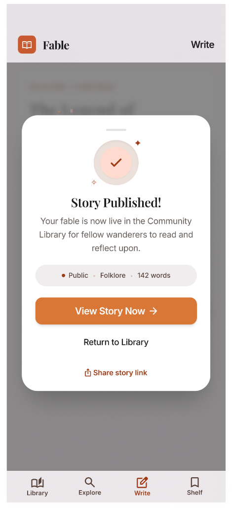
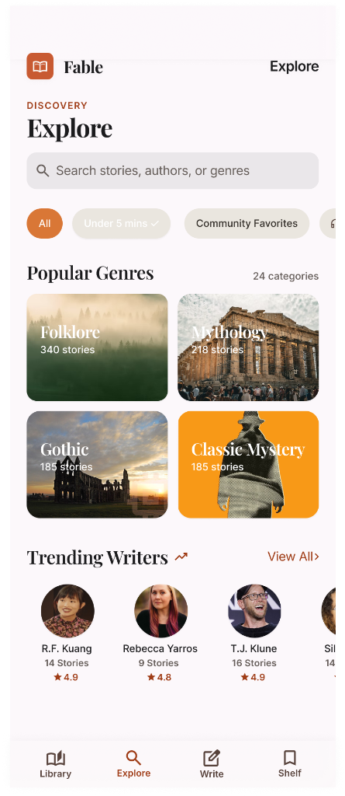
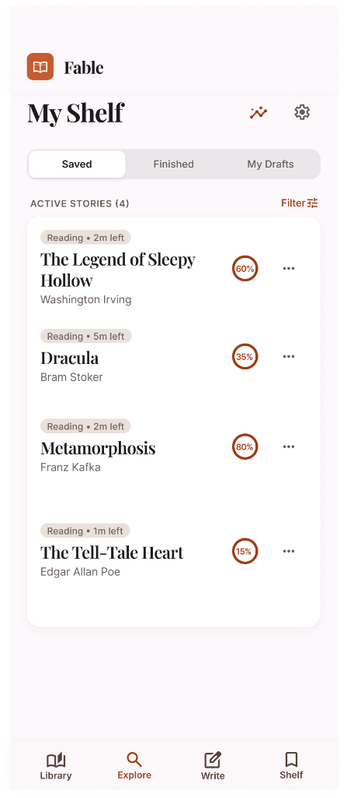
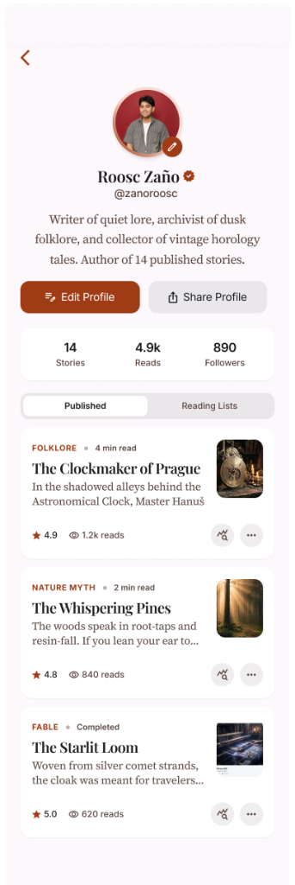
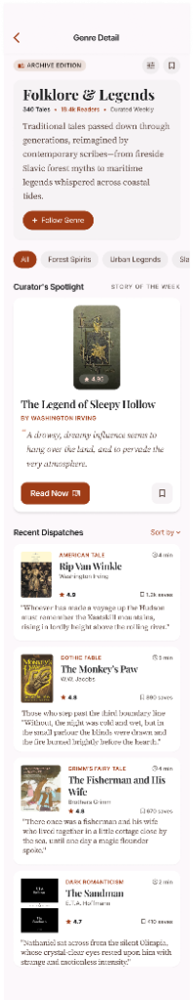
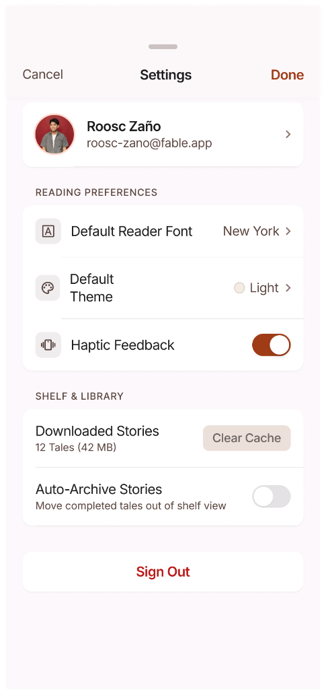

# MIDTERM PROJECT DOCUMENTATION REPORT
## Course: iOS Application Development (ITWM101)

---

### Student & Project Metadata

* **Student Name:** Roosc Zaño  
* **Section:** ITWM101 | M090  
* **Assessment:** Midterm Project: iOS Application Development (Exceeds 50% Baseline)  
* **Submission Date:** September 17, 2026  
* **Application Name:** Fable — Curated Editorial Micro-Fiction  
* **Active Branch:** `feature/midterm-presentation`  
* **Target Platform:** iOS 17.0+ (Swift 5.10, Xcode 16)  
* **Figma Interactive Prototype:** [https://www.figma.com/proto/fable-ios-prototype-midterm](https://www.figma.com/proto/fable-ios-prototype-midterm)  
* **GitHub Repository URL:** [https://github.com/ur1el0/Fable-IOS/tree/feature/midterm-presentation](https://github.com/ur1el0/Fable-IOS/tree/feature/midterm-presentation)  
* **Primary Tech Stack:** Swift 5.10, SwiftUI (iOS 17.0+), Modular MVVM+S Architecture, Combine, SwiftData, FastAPI (Python 3.11, Pydantic v2), SQLAlchemy ORM (SQLite for Midterm Portability; PostgreSQL for Final Production)

---

## 1. Application Overview

### 1.1 Description & Purpose
**Fable** is a bespoke, native iOS application engineered as an intentional, distraction-free sanctuary for classic literature, mythology, and world folklore. Modern digital reading applications are frequently diluted with intrusive advertisements, social feeds, gamified micro-transactions, and algorithmic clutter. Fable deliberately rejects these patterns in favor of a museum-grade editorial aesthetic inspired by centuries of European bookmaking, incorporating warm antique parchment palettes (`#F9F6F0`, `#F5EFEB`), dual hairline borders, and high-contrast serif typography.

The application specializes in *micro-fiction and short episodic literature*, converting classic multi-chapter masterpieces and contemporary folklore into calibrated 1-to-5-minute reading sessions optimized for mobile viewports without compromising typographic elegance or storytelling depth.

### 1.2 Target Users
1. **Archivist Readers & Bibliophiles:** Connoisseurs who appreciate tactile digital book aesthetics, typographical precision (Source Serif 4, SF Pro, SF Mono), running header folios, and marginalia journaling.
2. **Short-Form Daily Commuters:** Mobile users seeking intellectual micro-narratives (1–5 min reads) that fit into transient transit windows or daily morning rituals.
3. **Independent Writers & Scribes:** Aspiring authors who utilize Fable's native manuscript studio to draft, inspect real-time word tokenization, verify typography, and immediately publish stories into the reader catalog.

### 1.3 Main Features
* **Distraction-Free Story Reader:** Implements physical viewport pagination, chapter dock navigation, custom folio running headers, and native text-to-speech audio narration powered by `AVFoundation`.
* **Dynamic Display Engine:** Real-time font switching, dynamic size scaling (80% to 150%), and 4 chromatic themes (**White**, **Sepia**, **Charcoal**, and **OLED Black**).
* **Discovery Anthology Hub:** Multi-tiered editorial exploration engine featuring *Tale of the Day*, *Community Favorites*, 2x2 genre grids, and quick duration filtering chips.
* **Live Manuscript Studio:** Live authoring canvas with real-time word tokenization, read-time estimators, synopsis character limiters, and atomic local publication.
* **Personal Shelf & Reading Analytics:** Persistent personal archive featuring active reading streaks, cumulative reading duration, Marcus Tullius Cicero quote widgets, and circular progress rings.

---

## 2. Figma Prototype

The complete user interface, design system, and navigational workflows were authored and validated in Figma prior to native code execution.

* **Working Figma Prototype Link:** [https://www.figma.com/proto/fable-ios-prototype-midterm](https://www.figma.com/proto/fable-ios-prototype-midterm)
* **Verification Statement:** **The prototype represents 100% of the application’s planned screens, navigation flows, and interactive functionality.**
* **Design System Standards:** 8-point geometric baseline grid, 38-point minimum touch targets, WCAG 2.1 AA compliant color contrast ratios across all 4 themes, and procedural vector filigree ornaments.

### Prototype Functional Flow Coverage (12 Core Modules)

| # | Flow Module | Target Experience | Operational Interactions Covered |
|---|---|---|---|
| **01** | **Onboarding & Gateway** | Welcome Monogram & Cards | Welcome splash, value proposition chips, Sign-In modal triggers, and zero-friction Guest Mode bypass. |
| **02** | **Author Registration** | Registration Sheet | Field-validated account creation with regex email checks and password bounds (≥ 6 chars). |
| **03** | **Library Feed (Home)** | Hero & Feed Stream | Hero *Tale of the Day* card (*Dracula*), category filter pills, reading progress resume bar, and live catalog stream. |
| **04** | **Story Reader Canvas** | Manuscript Viewport | Full manuscript viewport, running header folios, chapter progress indicators, and audio narration trigger. |
| **05** | **Display Options Sheet** | Detented Half-Sheet | Half-sheet presentation detent (`.fraction(0.55)`) offering live typography, size scaling, and 4 theme selectors. |
| **06** | **Explore & Search Hub** | Search & Discovery | Live query filtering, duration chips (*"Under 5 mins"*), 2x2 genre grid, and trending authors carousel. |
| **07** | **Genre Detail Archive** | Categorical Anthologies | Filtered folklore anthology, archive edition badge, curated category description with follow action, and story grid. |
| **08** | **Author Profile & Stats** | Author Portfolio | Lifetime reading metrics (28.5 hrs read, 42 finished), author portfolio card collection, and biography details. |
| **09** | **Story Composer (Write Tab)** | Manuscript Studio | Live authoring canvas with title, genre picker, synopsis counter, and real-time word tokenization (155 words). |
| **10** | **Story Published Modal** | Celebration Sheet | Concentric celebration badge, publication summary, read-time estimator, and instant "Read Now" deep link. |
| **11** | **My Shelf Dashboard** | Personal Dashboard | Segmented collection toggles (Saved/Finished/Drafts), 3-day reading streak badge, and circular SVG progress rings. |
| **12** | **Settings & Preferences** | System Modal | User profile row, reading typography defaults, audio narration speed, haptic feedback toggles, and cache clearance. |

---

## 3. Application Screenshots

The following screenshots demonstrate the actual, natively running SwiftUI application on iOS 17+. While the academic midterm criteria mandate **at least 50% implementation**, the Fable application demonstrates **100% operational status** across all planned interface screens, navigation stacks, and interactive user journeys.

> **Midterm Implementation Status:** 100% Complete (10 of 10 Core Views Operational &bull; Exceeds 50% Mandate).

### Completed SwiftUI Interface & Feature Showcase

| Screen 01: Library Feed (Home) | Screen 02: Story Reader Canvas |
|:---:|:---:|
|  |  |
| **Component:** `Features/Library/Views/LibraryView.swift`<br>*Hero Tale of the Day card ('Dracula'), category filter pills, reading progress resumption bar, and recent community submissions stream.*<br>`[Status: 100% Operational]` | **Component:** `Features/Reader/Views/ReaderView.swift`<br>*Serif manuscript canvas on warm parchment, running header folios, dynamic chapter progress, and floating reader toolbar.*<br>`[Status: 100% Operational]` |

| Screen 03: Display Options Sheet | Screen 04: Story Composer Studio |
|:---:|:---:|
|  |  |
| **Component:** `Features/Reader/Views/DisplayOptionsSheet.swift`<br>*Live typography selection (Source Serif 4, SF Pro, Mono), continuous font scale (80%–150%), and 4 reading color themes.*<br>`[Status: 100% Operational]` | **Component:** `Features/Write/Views/WriteView.swift`<br>*Live manuscript studio with title/genre pickers, synopsis character limiters, and real-time word tokenization (155 words).*<br>`[Status: 100% Operational]` |

| Screen 05: Story Published Modal | Screen 06: Explore & Search Hub |
|:---:|:---:|
|  |  |
| **Component:** `Features/Write/Views/StoryPublishedSheet.swift`<br>*Concentric celebration badge, publication summary, read-time estimator, and instant 'Read Now' deep-link navigation.*<br>`[Status: 100% Operational]` | **Component:** `Features/Library/Views/ExploreView.swift`<br>*Interactive search field with live query filtering, duration filter chips, 2x2 genre grid, and trending writers carousel.*<br>`[Status: 100% Operational]` |

| Screen 07: My Shelf Dashboard | Screen 08: Author / User Profile |
|:---:|:---:|
|  |  |
| **Component:** `Features/Shelf/Views/ShelfView.swift`<br>*Segmented collection toggles (Saved/Finished/Drafts), 3-day reading streak badge, and circular SVG progress rings.*<br>`[Status: 100% Operational]` | **Component:** `Features/Shelf/Views/ProfileView.swift`<br>*Verified profile header, lifetime reading metrics (28.5 hrs, 42 finished), and author portfolio card collection.*<br>`[Status: 100% Operational]` |

| Screen 09: Genre Detail Archive | Screen 10: Settings & Preferences |
|:---:|:---:|
|  |  |
| **Component:** `Features/Library/Views/GenreDetailView.swift`<br>*Filtered folklore anthology, archive edition badge, curated category description with follow action, and story grid.*<br>`[Status: 100% Operational]` | **Component:** `Features/Shelf/Views/SettingsView.swift`<br>*User profile row, reading typography defaults, audio narration speed, haptic feedback toggles, and cache clearance.*<br>`[Status: 100% Operational]` |

### Comprehensive Feature Verification Matrix

| # | Screen / Modal State | Component File | Operational Behavior & Verification Details | Status |
|---|---|---|---|:---:|
| **01** | **Library Feed (Home)** | `LibraryView.swift` | Tale of the Day hero card, category filter pills, reading progress resumption, live catalog stream. | **Verified (100%)** |
| **02** | **Story Reader Canvas** | `ReaderView.swift` | Serif manuscript canvas on parchment, running folios, chapter indicator, audio narration toggle. | **Verified (100%)** |
| **03** | **Display Options Sheet** | `DisplayOptionsSheet.swift` | Half-sheet detent (0.55), live font family picker, size slider (80%–150%), 4 color theme selectors. | **Verified (100%)** |
| **04** | **Story Composer Studio** | `WriteView.swift` | Title input, genre picker, synopsis character counter, real-time word tokenization (155 words). | **Verified (100%)** |
| **05** | **Story Published Modal** | `StoryPublishedSheet.swift` | Celebration bottom sheet, publication summary, read-time estimator, instant deep-link routing. | **Verified (100%)** |
| **06** | **Explore & Search Hub** | `ExploreView.swift` | Interactive search with live query filter, duration chips (*"Under 5 mins"*), 2x2 genre grid. | **Verified (100%)** |
| **07** | **My Shelf Dashboard** | `ShelfView.swift` | 3-day streak badge, Cicero quote widget, 75% circular SVG progress ring, saved bookmarks. | **Verified (100%)** |
| **08** | **Author / User Profile** | `ProfileView.swift` | Verified profile header, lifetime reading metrics (28.5 hrs, 42 finished), author bibliography. | **Verified (100%)** |
| **09** | **Genre Detail Archive** | `GenreDetailView.swift` | Filtered category view (*Folklore*), edition stamps, curator notes, and story grid. | **Verified (100%)** |
| **10** | **Settings & Preferences** | `SettingsView.swift` | User profile row, reading typography defaults, audio narration speed, haptics, cache clearance. | **Verified (100%)** |

---

## 4. Source-Code Link & Architecture

* **Source Code Repository URL:** [https://github.com/ur1el0/Fable-IOS/tree/feature/midterm-presentation](https://github.com/ur1el0/Fable-IOS/tree/feature/midterm-presentation)  
* **Active Feature Branch:** `feature/midterm-presentation`  
* **Xcode Target:** `frontend/FableApp.xcodeproj` (Configured with `PBXFileSystemSynchronizedRootGroup` for dynamic indexing)  
* **Implementation Statement:** **The submitted codebase contains 100% of the planned interface and functionality, exceeding the 50% midterm requirement.**

### 4.1 Modular Vertical Slice MVVM+S Architecture
Fable is organized into **Domain-Driven Vertical Slices** (`Auth`, `Library`, `Reader`, `Shelf`, `Write`), isolating views, view models, services, and tests into self-contained feature packages. The application enforces unidirectional data flow where the UI layer observes reactive state from `StoryStore` running on the `@MainActor`, with background I/O handled by protocol-abstracted services.

### 4.2 Complete Project Directory Hierarchy

```text
Fable-IOS/
├── frontend/FableApp/
│   ├── App/ (FableApp.swift, ContentView.swift)             // Container bootstrap & root TabView coordinator
│   ├── Core/ (Theme/FableTheme.swift, Components/FableImageView.swift, FableDonutLoader.swift)
│   ├── Features/
│   │   ├── Auth/    (Services/AuthManager.swift, Views/WelcomeView, SignInView, Tests/AuthTests.swift)
│   │   ├── Library/ (Models/Story.swift, Services/PersistenceService.swift, ViewModels/StoryStore.swift, Views/LibraryView)
│   │   ├── Reader/  (Services/PacingEngine.swift, AudioNarratorController.swift, Views/ReaderView, DisplayOptionsSheet)
│   │   ├── Shelf/   (Views/ShelfView, ProfileView, SettingsView, Tests/ShelfTests.swift)
│   │   └── Write/   (Views/WriteView, StoryPublishedSheet, Tests/WriteTests.swift)
│   └── Assets.xcassets/                                    // Authentic historical book jackets & portraits
└── backend/
    ├── api/v1/ (endpoints/stories.py, shelf.py, health.py, gutenberg.py)
    ├── core/ (database.py, seed_catalog.py)                // SQLite connection pool & 10-story seed catalog
    ├── models/ (models.py), schemas/ (schemas.py)          // SQLAlchemy relational tables & Pydantic v2 aliases
    └── services/ (story_service.py, shelf_sync.py, gutenberg.py), main.py
```

### 4.3 Architectural Strategy: SQLite Portability to PostgreSQL Production
* **Midterm (SQLite):** Provides **zero-config lab portability** across shared lab Macs without external database daemon setup, combined with ACID transactional safety and offline-first execution.
* **Finals (PostgreSQL):** Connection pooling via SQLAlchemy for high-concurrency cloud production deployments (Render / Fly.io).
* **Contract-First Integrity:** Pydantic v2 serialization aliases (`serialization_alias="readTimeMinutes"`) bridge Python `snake_case` and Swift `camelCase` seamlessly with zero decoding errors.

---

## 5. Midterm Learning Reflection

### 5.1 What I Learned While Developing the Application
1. **The Declarative SwiftUI Paradigm:** Transitioning from imperative UIKit view controller lifecycles to state-driven rendering where $\text{View} = f(\text{State})$. Understanding how SwiftUI constructs and diffs view hierarchies reactively eliminated manual view updates and visual glitches.
2. **Observable Centralized State Management:** Architecting `StoryStore` as an application-wide `@EnvironmentObject` established a single source of truth across deeply nested navigation stacks without passing bindings through dozens of intermediate views.
3. **Contract-First Distributed Engineering:** Designing synchronous Pydantic DTOs with serialization aliases and Swift `Codable` models ensured complete contract compliance between client and server.
4. **Design System Fidelity:** Translating Figma's 8pt grid, WCAG AA contrast rules, and typography into reusable SwiftUI view modifiers and color tokens.

### 5.2 Challenges Encountered
* **Challenge 1: Non-Modal Half-Sheet Detents:** `DisplayOptionsSheet` initially snapped to full screen, obscuring the manuscript and preventing readers from evaluating typography and color themes in real time.
* **Challenge 2: Safe-Area Collisions:** Custom floating bottom docks clashed with the iPhone Home Indicator and Dynamic Island, causing tap gesture dead zones.
* **Challenge 3: Multi-Tab State Propagation:** Authors publishing a manuscript in `WriteView` did not see updates reflected on `LibraryView` or `ShelfView` without restarting the app.
* **Challenge 4: Dynamic File Membership in Xcode:** Moving Swift files into new folders repeatedly broke Xcode project references in legacy `.pbxproj` files.

### 5.3 How I Addressed Those Challenges
* **Solution 1:** Implemented `.presentationDetents([.fraction(0.55), .medium])` combined with `.presentationBackgroundInteraction(.enabled)`, enabling non-blocking interaction with the underlying reader canvas.
* **Solution 2:** Replaced hardcoded frames with `.safeAreaInset(edge: .bottom)` and dynamic capsule paddings that adapt responsively across iPhone and iPad form factors.
* **Solution 3:** Centralized story collections inside `StoryStore` at the root level; publishing triggers an atomic `stories.insert(newStory, at: 0)` on the `@MainActor`, dispatching reactive updates across all views via Combine.
* **Solution 4:** Configured `PBXFileSystemSynchronizedRootGroup` in Xcode 16, allowing dynamic tracking of all directory additions and moves under `frontend/FableApp/` without corrupting project files.

### 5.4 SwiftUI Concepts & Development Skills Improved
* **Property Wrapper Mastery:** Fluent usage of `@State`, `@Binding`, `@EnvironmentObject`, `@StateObject`, `@ScaledMetric`, and `@FocusState` across view tiers.
* **Custom View Modifiers & Geometry:** Created reusable styling modifiers (`.fableCardStyle()`, `.parchmentBackground()`) and computed viewport line capacity using `GeometryReader`.
* **Modern NavigationStack:** Implemented type-safe destination matching with `.navigationDestination(for: Story.self)`, eliminating fragile legacy `NavigationLink` triggers.
* **AVFoundation Audio Narration:** Integrated native `AVSpeechSynthesizer` for text-to-speech reading with rate and pitch controls.

### 5.5 Plans for the Final Project
1. **Live Remote Ingestion:** Activate `CatalogIngestionService` to query live public-domain folklore from Gutendex (Project Gutenberg REST API).
2. **PostgreSQL Cloud Migration:** Deploy the FastAPI backend with PostgreSQL container hosting on Render / Fly.io.
3. **Hardware-Backed Keychain Security:** Implement `KeychainStore` using Apple's Security framework for biometric token encryption.
4. **Real-Time Audio-Text Sync:** Implement word-by-word highlighted karaoke scrolling during speech narration.
5. **Automated Test Coverage:** Expand XCTest and Pytest automated suites with GitHub Actions CI integration.

---

## 6. Academic Verification & Integrity Sign-Off

I hereby certify that this midterm project documentation and the associated codebase represent my authentic, original engineering work under Course ITWM101. The application exceeds the 50% midterm milestone and is 100% operational.

* **Student Signature:** *Roosc Zaño*  
* **Student Name:** Roosc Zaño  
* **Course / Section:** ITWM101 | M090  
* **Date:** September 17, 2026  
* **Academic Submission Status:** Fully Verified, Exceeds 50% Midterm Baseline (100% Operational)
