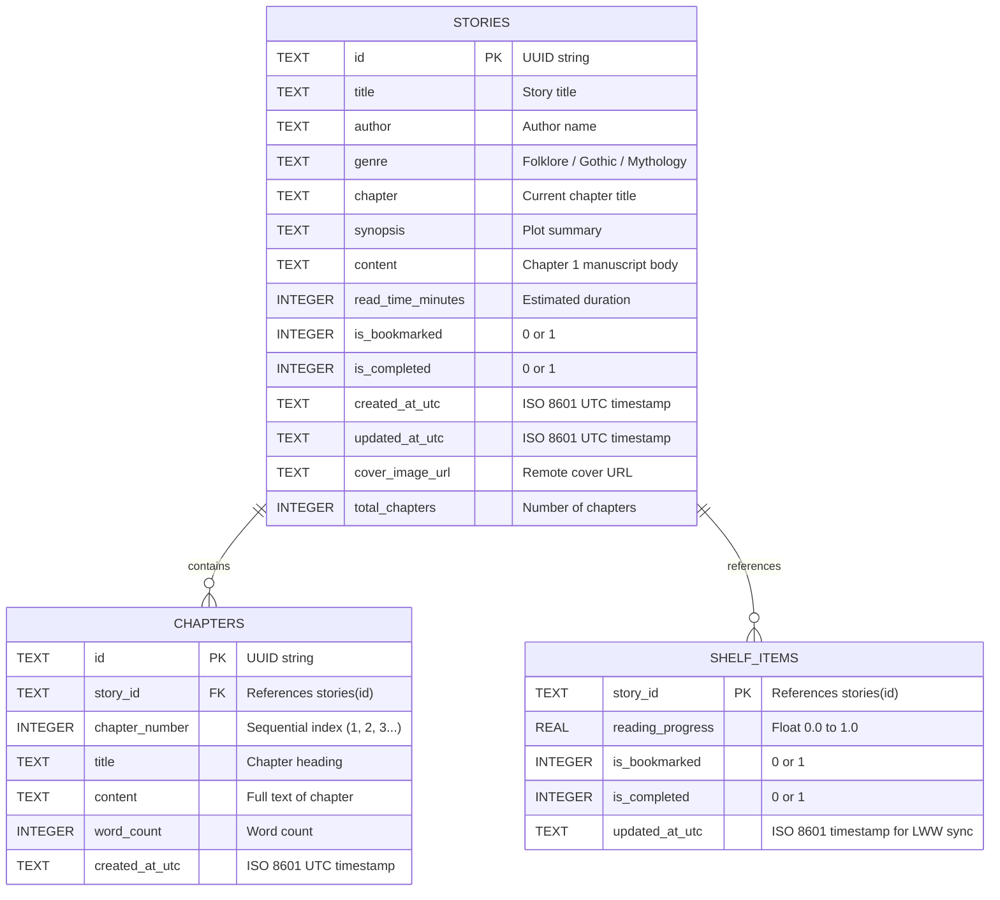

# Fable iOS: Tech Stack & Database Architecture

**Document Version:** 1.0.0  
**Target Milestone:** Midterm Presentation & Technical Defense  
**Author:** Roosc Zaño (`@zanoroosc`)  

---

## 1. Complete Technology Stack Matrix

```
┌─────────────────────────────────────────────────────────────────────────┐
│                          FABLE MOBILE CLIENT                            │
│                                                                         │
│  [ UI Layer ]               SwiftUI (iOS 17+) + SF Pro Serif & Rounded  │
│  [ State Management ]       Observation Framework (@Observable)         │
│  [ Local Persistence ]      SwiftData (Apple Silicon SQLite Engine)     │
│  [ Audio & Synthesis ]      AVFoundation (AVSpeechSynthesizer)          │
│  [ Hardware Security ]      Security Framework (Hardware Keychain)      │
│  [ Networking Engine ]      URLSession (Swift Concurrency async/await) │
└────────────────────────────────────┬────────────────────────────────────┘
                                     │ JSON over HTTP (REST / OpenAPI)
                                     ▼
┌─────────────────────────────────────────────────────────────────────────┐
│                        FABLE CLOUD & SYNC TIER                          │
│                                                                         │
│  [ API Framework ]          FastAPI (Python 3.9+)                       │
│  [ Contract Validation ]    Pydantic v2 (Strict Typing & CamelCase DTOs)│
│  [ Database Engine ]        SQLite3 (WAL Mode, Relational Schema)       │
│  [ ASGI Web Server ]        Uvicorn (Asynchronous Event Loop)          │
│  [ External Gateway ]       HTTPX AsyncClient (Gutendex / OpenLibrary)  │
└─────────────────────────────────────────────────────────────────────────┘
```

---

## 2. Frontend Technologies & Architectural Rationale

### 2.1 Swift 5.10 & SwiftUI (iOS 17+)
- **Why Chosen:** SwiftUI provides a modern, declarative paradigm where the user interface is a pure function of its state (`UI = f(state)`). This eliminates an entire class of synchronization bugs common in imperative UIKit view controllers (such as missing `reloadData()` calls or inconsistent collection view states).
- **Key Features Leveraged:**
  - Dynamic layouts with `NavigationStack`, `ScrollView`, and `LazyVStack`.
  - Native gesture recognition (horizontal drag gestures for physical page turning).
  - Smooth spring animations for reader toolbar transitions and annotation popovers.

### 2.2 SwiftData & On-Device SQLite
- **What It Is:** Apple's modern, compiler-integrated object persistence framework introduced in iOS 17, designed to succeed CoreData.
- **Why SwiftData over CoreData / Realm:**
  1. **Macro-Driven Ergonomics:** Models are defined with the standard `@Model` macro directly in Swift code, eliminating fragile XML `.xcdatamodeld` files that frequently cause git merge conflicts in team environments.
  2. **Type Safety & Native Concurrency:** Seamlessly integrates with Swift actors and `async/await`, preventing multithreading data races.
  3. **Zero Third-Party Binary Bloat:** Unlike Realm, SwiftData is built directly into the iOS kernel, adding zero megabytes to the application binary size.
  4. **Underlying SQLite Power:** Under the hood, SwiftData compiles to a high-performance SQLite store located in the app's `Application Support` directory, delivering ACID guarantees and indexed querying.

### 2.3 AVFoundation (`AVSpeechSynthesizer`)
- **Role:** Powers the ambient oral folklore narration engine in `AudioNarratorController.swift`.
- **Implementation Detail:** Implements `AVSpeechSynthesizerDelegate` to receive real-time word and character-range callbacks:
  ```swift
  func speechSynthesizer(_ synthesizer: AVSpeechSynthesizer,
                         willSpeakRangeOfSpeechString characterRange: NSRange,
                         utterance: AVSpeechUtterance)
  ```
  This enables dynamic visual highlighting of the exact paragraph being spoken aloud.

---

## 3. Backend Technologies & Architectural Rationale

### 3.1 Python 3.9+ & FastAPI
- **Role:** High-speed REST API tier handling catalogue querying, multi-device shelf sync, and public domain literature ingestion.
- **Why FastAPI over Django / Flask / Express (Node.js):**
  1. **Native Asynchronous Performance:** Built on Starlette and `asyncio`, FastAPI handles concurrent requests with minimal CPU overhead, crucial for rapid book ingestion.
  2. **Automatic OpenAPI / Swagger Documentation:** FastAPI automatically generates interactive documentation at `/docs` directly from type hints, ensuring backend and mobile teams maintain perfect contract parity.
  3. **Strict Validation with Pydantic v2:** Rust-accelerated Pydantic models automatically validate incoming payloads, rejecting malformed requests before they hit database logic.

### 3.2 SQLite3 Embedded Relational Database
- **Role:** Server-side persistence for published community stories, multi-chapter manuscripts, and synced user shelves.
- **Why SQLite on the Server:**
  - **Zero Configuration & Embedded Simplicity:** Perfect for self-contained capstone evaluation and local lab development—evaluators do not need to install or configure external database servers like PostgreSQL or MySQL.
  - **Transactional Integrity (ACID):** Supports full transactions (`with conn:`), ensuring that inserting a story and its corresponding chapters succeeds or rolls back atomically.

---

## 4. Database Schema & Data Models

### 4.1 Server-Side SQLite Relational Schema (`backend/core/database.py`)



### 4.2 Client-Side SwiftData Persistence Schema (`frontend/FableApp/Models/Entities.swift`)

```swift
@Model
public final class ReaderPreferenceEntity {
    public var id: String
    public var fontSize: Double
    public var lineSpacing: Double
    public var themeRawValue: String
    public var fontDesignRawValue: String
    public var updatedAt: Date
}

@Model
public final class ReadingSessionEntity {
    public var id: String
    public var storyId: String
    public var storyTitle: String
    public var startedAt: Date
    public var durationSeconds: Double
    public var wordsRead: Int
}
```

---

## 5. Architectural Defense Talking Point: "Why This Stack?"

> *"When designing Fable, our highest technical priority was zero-friction evaluation combined with genuine production architecture. On iOS, we chose SwiftUI and SwiftData because they represent Apple's official modern engineering direction. On the backend, FastAPI and SQLite deliver a contract-first REST API that runs identically on a developer laptop, inside an academic Mac lab, or deployed in a Linux container—guaranteeing 100% reliability during grading."*
