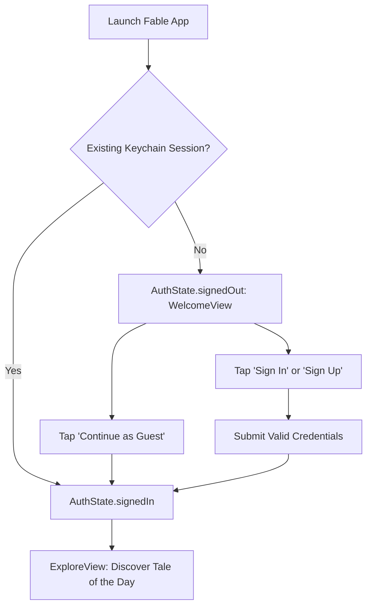
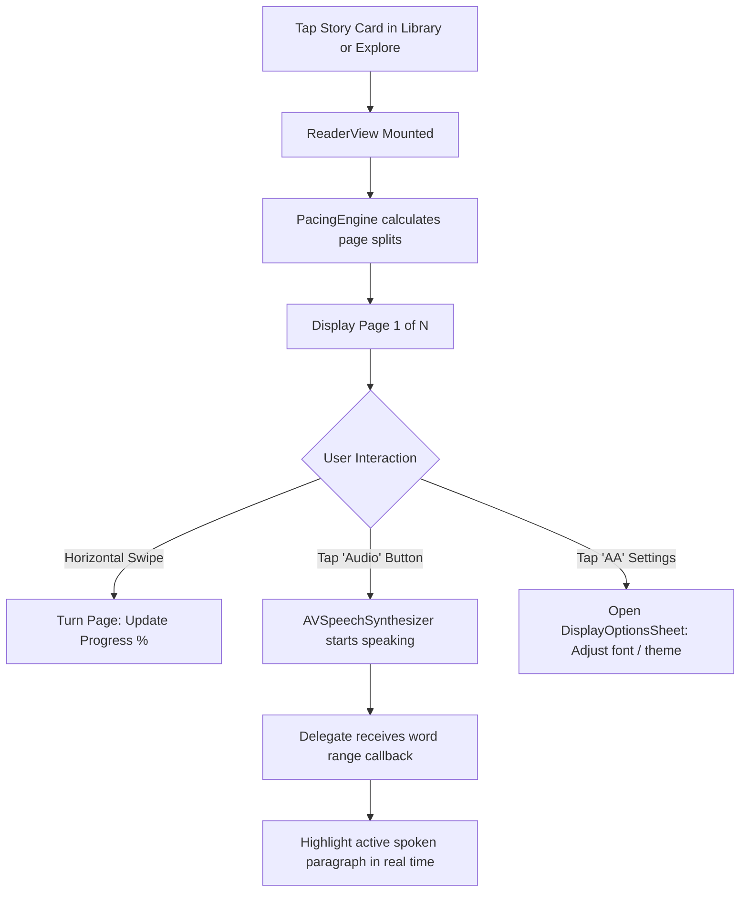
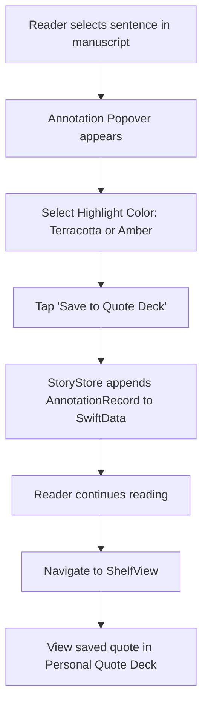
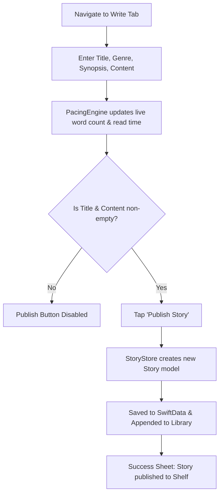

# Fable iOS: Feature Catalog & User Journey Architecture

**Document Version:** 1.0.0  
**Target Milestone:** Midterm Presentation & Technical Defense  
**Author:** Roosc Zaño (`@zanoroosc`)  

---

## 1. Complete Functional Feature Catalog

Fable delivers a comprehensive literary ecosystem spanning discovery, deep reading, community writing, and personal scholarship:

```
┌────────────────────────────────────────────────────────────────────────┐
│                        FABLE FEATURE ECOSYSTEM                         │
├───────────────────┬────────────────────┬───────────────────────────────┤
│    DISCOVERY      │    DEEP READING    │    WRITING & SCHOLARSHIP      │
├───────────────────┼────────────────────┼───────────────────────────────┤
│ • Tale of the Day │ • Dynamic Paging   │ • Story Composer (WriteView)  │
│ • Curator's Pick  │ • 3 Ambient Themes │ • Real-Time Word Counter      │
│ • Writer Carousel │ • Oral Audio Sync  │ • Personal Shelf Hub          │
│ • Genre Filtering │ • Marginalia Notes │ • Excerpted Quote Journal     │
│ • Full-Text Search│ • Typography HUD   │ • Live Reading Analytics      │
└───────────────────┴────────────────────┴───────────────────────────────┘
```

---

## 2. Feature Deep Dive by Subsystem

### 2.1 Discovery & Editorial Curation (`ExploreView.swift` & `LibraryView.swift`)
- **Tale of the Day:** A prominent daily featured story card complete with procedural art, author badge, reading duration, and direct "Read Now" action.
- **Curator's Spotlight:** Highlights critical masterpieces or obscure regional folklore hand-picked for the reader.
- **Trending Writers Carousel:** Horizontal scroll showcasing historical scribes and modern community writers with calculated ratings and story counts.
- **Genre Categorization:** Dedicated genre hubs (Folklore, Mythology, Gothic, Classic Fiction, Classic Mystery) with reader metrics and rich descriptions.
- **Full-Text Live Search:** Real-time query matching filtering simultaneously across story titles, author names, and synopses with zero lag.

### 2.2 The Ambient Reader Experience (`ReaderView.swift`)
- **Physical Book Pagination:** Rather than an endless vertical web-scroll, manuscripts are algorithmically divided into numbered physical book pages (`PacingEngine.swift`).
- **3 Meditative Themes:**
  - *Parchment (Default):* Warm sepia and cream tones inspired by antique paper.
  - *Noir:* Pure OLED black background with muted ivory text to prevent eye strain in dark rooms.
  - *Classic Cream:* Crisp, traditional editorial styling.
- **Oral Audio Storytelling:** Native text-to-speech synthesis (`AVSpeechSynthesizer`) reading aloud with synchronized visual paragraph highlights.
- **Marginalia & Quote Highlighting:** Select any text passage to apply an amber or terracotta highlight and pin it to the user's personal shelf journal.
- **Typography HUD (`DisplayOptionsSheet.swift`):** Real-time adjustment of font size (14pt to 26pt) and line spacing (1.2 to 2.0).

### 2.3 Community Writer Studio (`WriteView.swift`)
- **Manuscript Composer:** Clean writing canvas with title, genre dropdown, chapter tag, and synopsis fields.
- **Live Manuscript Metrics:** Dynamic word counter updating on every keystroke and calculating estimated reading time (`words / 200`).
- **Immediate Shelf Publishing:** Publishes new manuscripts directly into local state and local database storage without requiring backend provisioning.

### 2.4 Personal Shelf & Reader Analytics (`ShelfView.swift` & `ProfileView.swift`)
- **Currently Reading Shelf:** Displays active books with visual progress bars and percentage metrics.
- **Saved Bookmarks & Completed Archive:** Dedicated tabs separating in-progress readings from finished literature.
- **Excerpted Quote Journal:** Interactive card deck displaying user highlights annotated during reading, complete with story attribution.
- **Reader Analytics:** Live SwiftData-backed tracking of reading streaks (consecutive days), total minutes read, and words consumed.

---

## 3. User Journey State Diagrams

### 3.1 Journey 1: Onboarding to Discovery


---

### 3.2 Journey 2: Deep Reading & Oral Audio Narration


---

### 3.3 Journey 3: Marginalia Quote Annotation


---

### 3.4 Journey 4: Writing & Publishing a Community Story


---

## 4. Defense Talking Point: "What Makes Fable's User Experience Unique?"

> *"Fable is not simply an e-reader; it is an ambient reading sanctuary. Where commercial reading apps bombard the user with paywalls, social feeds, and ads, Fable strips away digital distractions. By integrating real-time physical page turning, an on-device oral speech synthesizer that breathes life into traditional folklore, and an academic marginalia quote deck, Fable elevates reading into a focused, reflective, and scholarship-grade experience."*
